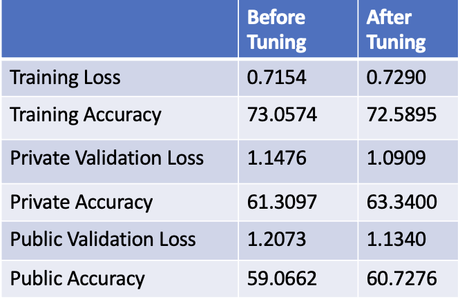
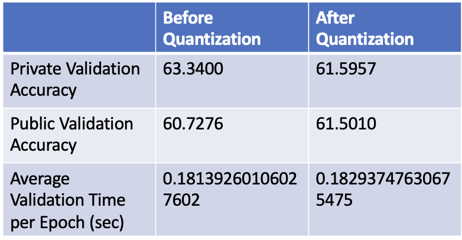

# 6998 HPML Final Project

## Description

The overarching goal of this project is to enhance an existing Lightweight facial emotion recognition system on GitHub by optimizing its data processing, model performance, and deployment efficiency. We will retrain the model with the existing model and we aim to achieve higher recognition accuracy and better runtime performance by several optimization techniques. 

## Outline of the code respository

./dataset: dataset in csv format used for training\
./src: all source code for training and optimizing\
---PlotNumWorkers.py\
---model.py: define network structure\
---train.py: final optimized model\
---trainHPtuning.py: code used for hyperparameter tuning\
./outputs: raw output saved in numpy array\
./plots: images of result plots\
./trained: save trained model checkpoints\

## Execute

1. Prepare the dataset: please see [here](./dataset/README.md)

2. Hardware Requirements:
   * CPU: 8 vCPU, 4 cores, 30 GB memory
   * GPU: 1 NVIDIA T4 GPU
     
3. Install Software:
   * PyTorch
   * Wandb
```
pip install torch==1.13.1+cu116 torchvision==0.14.1+cu116 torchaudio==0.13.1 --extra-index-url 	https://download.pytorch.org/whl/cu116
pip install wandb
```

4. Retrain the model
   * Command line parameter: number of workers in DataLoader as command line parameter (default: 1)
```
cd src
python train.py -n 8
```

## Results
1. Data Augmentation: 
2. Dataloading optimization:
   The dataloading time decreases consistently as the number of workers increases. We will use 8 number of workers for further optimizations, which is the maximum number of workers available as we are using 8 CPU.\
   
   
3. Hyperparameter Tuning:
   The optimal configuration is:
   

   AFter retraining the model with optimal set of parameters, the accuracy of both training and validation set increases. 
   
   Link to Weights and Biase Project: https://wandb.ai/6998/6998-proj2?workspace=user-qg2205 

4. Quantization:
   From the table, quantization is not an effective optimization technique for this model. 
   
   
## Reference

* Base Model: https://github.com/yoshidan/pytorch-facial-expression-recognition
